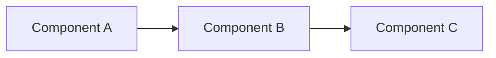

## RFC Metadata

**RFC Number:** (Auto-assigned by maintainers)  
**Status:** Draft | Under Review | Accepted | Rejected | Implemented  
**Author(s):** @your-github-username  
**Created:** YYYY-MM-DD  
**Last Updated:** YYYY-MM-DD  
**Target Version:** 0.2.0 | 1.0.0 | etc.

---

## Abstract

> **Provide a 2-3 sentence summary of the proposal.**  
> This should be concise enough for someone to quickly understand what you're proposing without reading the entire RFC.

---

## Motivation

### Problem Statement

> **What problem does this RFC solve?**  
> Describe the gap in SCP's current functionality or design that this proposal addresses.

### Real-World Use Cases

> **Provide concrete examples of how users are impacted by this gap.**  
> Include specific scenarios, pain points, or workflows that would be improved.

Example:

- Use Case 1: [Description]
- Use Case 2: [Description]

---

## Goals

### Primary Goals

> **List the main objectives of this proposal.**

- [ ] Goal 1
- [ ] Goal 2
- [ ] Goal 3

### Non-Goals

> **What is explicitly out of scope for this RFC?**  
> This helps set boundaries and manage expectations.

- Not intended to...
- Will not address...

---

## Proposed Solution

### High-Level Design

> **Provide an overview of your proposed solution.**  
> Include diagrams if helpful (Mermaid diagrams are supported in GitHub).



### Detailed Design

> **Explain the technical details of your proposal.**

#### Schema Changes

> If this RFC proposes changes to the SCP schema, include examples here:

```yaml
# Example scp.yaml with proposed changes
scp: "0.2.0"

system:
  urn: "urn:scp:example"
  name: "Example Service"

# NEW FIELD
new_section:
  property: "value"
```

#### API / Tooling Changes

> If this affects scp-cli, scp-viewer, or other tools, describe those changes:

```bash
# Example new CLI command
scp-cli validate new-feature --option value
```

#### JSON Export Changes

> If the unified JSON graph output changes, show the new structure:

```json
{
  "nodes": [...],
  "edges": [...],
  "meta": {
    "new_field": "value"
  }
}
```

---

## Examples

### Example 1: [Scenario Name]

> **Show a complete example of how this feature would be used.**

```yaml
# Before
# [Current way to do something]

# After with this RFC
# [New way to do it]
```

### Example 2: [Scenario Name]

> **Another example showing a different use case.**

---

## Alternatives Considered

### Alternative 1: [Name]

**Approach:** [Brief description]

**Rejected because:**

- ❌ Reason 1
- ❌ Reason 2

### Alternative 2: [Name]

**Approach:** [Brief description]

**Rejected because:**

- ❌ Reason 1
- ❌ Reason 2

---

## Open Questions

> **List any unresolved questions that need community input.**

### Q1: [Question]

**Context:** [Why this matters]

**Options:**

- A) [Option A]
- B) [Option B]
- C) [Option C]

**Recommendation:** [Your suggested answer, if any]

### Q2: [Question]

...

---

## Impact Analysis

### Breaking Changes

> **Will this RFC introduce breaking changes to existing SCP manifests?**

- [ ] Yes, breaking changes (requires major version bump)
- [ ] No, fully backward compatible
- [ ] Partially backward compatible (specify what breaks)

**Migration Path:**

> If breaking changes exist, describe how users can migrate:

```bash
# Example migration steps
scp-cli migrate --from 0.1.0 --to 0.2.0
```

### Ecosystem Impact

> **Which projects/tools will be affected?**

- [ ] scp-definition (schema)
- [ ] scp-integrations (CLI tooling)
- [ ] scp-viewer (visualization)
- [ ] scp-demo (examples)
- [ ] Third-party integrations

---

## References

> **Link to relevant specifications, prior art, or related discussions.**

- [Related Issue #123](https://github.com/krackenservices/scp-definition/issues/123)
- [External Spec](https://example.com)
- [Prior Discussion](https://github.com/krackenservices/scp-definition/discussions/456)

---

## Discussion

> **This section will be populated during the RFC review process.**  
> Maintainers and community members will add comments, questions, and suggestions here.

---

## Decision

> **To be filled in by maintainers after review.**

**Status:** Accepted | Rejected | Deferred  
**Date:** YYYY-MM-DD  
**Reason:** [Brief explanation of decision]

**Action Items:**

- [ ] Update specification
- [ ] Implement in scp-integrations
- [ ] Add examples to scp-demo
- [ ] Update documentation
